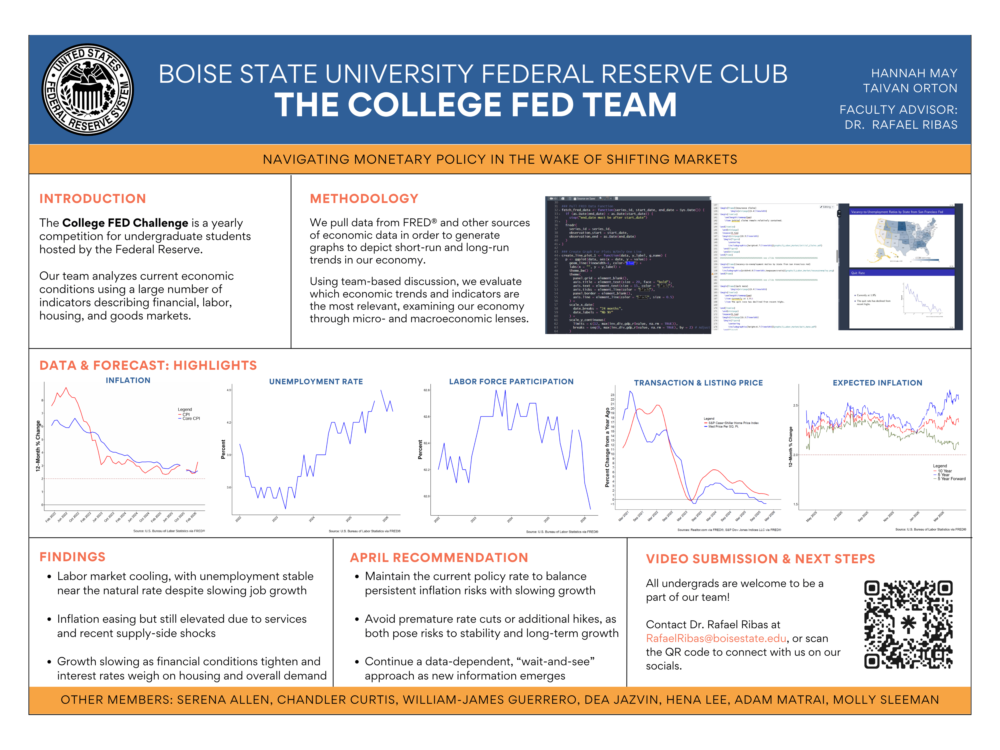

# Boise State University Federal Reserve Club
## College FED Challenge -- Economic Research & Analysis

I am a member of the Boise State University Federal Reserve Club and College Fed Challenge team, where I analyze current economic conditions and monetary policy using economic and financial data.

As part of the team, I research trends across financial, labor, housing, and goods markets and use data from FRED and other economic sources to evaluate current economic conditions. I create and analyze economic visualizations, discuss the significance of economic indicators with the team, and contribute to presentations and recommendations regarding monetary policy.

## Research Poster
### Navigating Monetary Policy in the Wake of Shifting Markets

The poster summarizes our analysis of labor-market conditions, inflation, economic growth, financial conditions, housing, and expected inflation. Our April recommendation was to maintain the current policy rate while continuing a data-dependent, "wait-and-see" approach in light of persistent inflation risks and slowing growth.

## Skills & Tools
* Economic & financial data analysis
* Macroeconomic research
* Data visualization
* FRED economic data
* Quantitative analysis
* Economic research & presentation
* Team-based analysis

👉 [Click here for PDF of Poster](FedClub_Poster.pdf)
